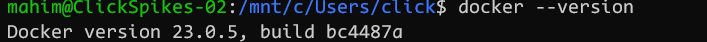
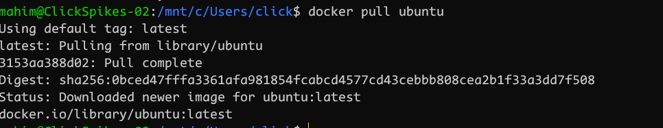
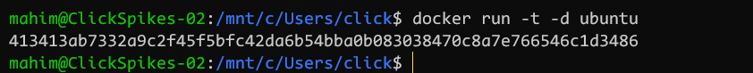
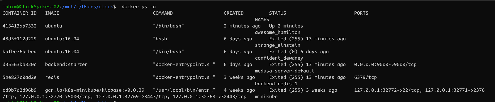
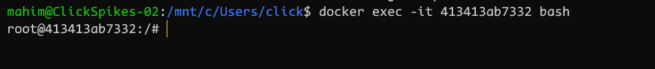
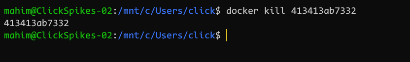

# docker uses

 - **docker --version** <br> with this command we can check the Docker version like this:
 

 - **docker pull** <br> Usege: ``` docker pull <image name>``` <br> <br>
 This command is used to pull images form the docker [repository](https://hub.docker.com/) like this:
 

 - **docker run** <br> Usege: ``` docker run <image name> ``` <br> This command is used to create a container from an image like this:
 
  - **docker ps** <br> This command is used to list the running containers like this:
   
  
  - **docker ps -a** <br> This command is used to show all the running and exited containers like this:
  

  - **docker exec** <br>Usage: ```docker exec -it <container id> bash```
  This command is used to access the running container like this:
  

  - **docker stop** <br>
  Usage: ```docker stop <container id>``` 
  This command stops a running container like this:
   
  - **docker kill** <br>    
  Usage: ```docker kill <container id>``` <br>
    This command kills the container by stopping its execution immediately. The difference between ‘docker kill’ and ‘docker stop’ is that ‘docker stop’ gives the container time to shutdown gracefully, in situations when it is taking too much time for getting the container to stop, one can opt to kill it like this:
    


